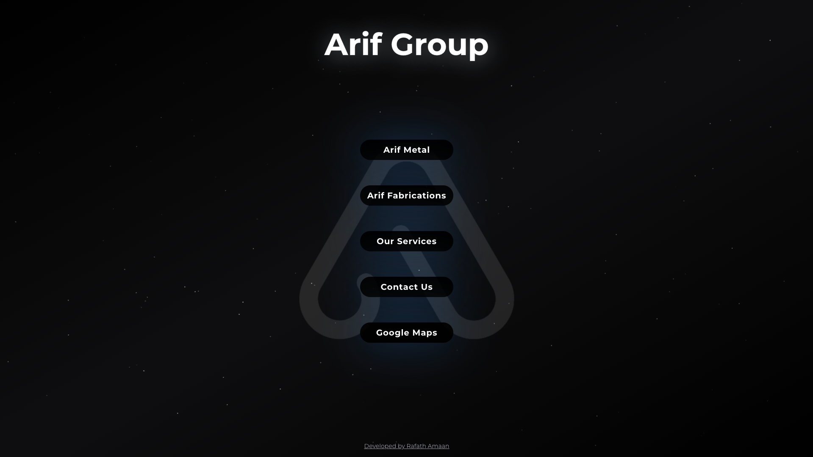

    <a href="https://www.ArifGroup.in"><h1 align="center">ArifGroup.in</h1></a>

My personal website for business, built with [Next.js](https://nextjs.org/), [Tailwind CSS](https://tailwindcss.com/), [Upstash](https://upstash.com?ref=chronark.com), [Contentlayer](https://www.contentlayer.dev/) and deployed to [Vercel](https://vercel.com/).
## SEO-Optimized Content
Well-written meta descriptions, headings, and alt tags for images.
 Generated dynamic XML sitemaps to ensure seamless crawling and indexing by search engines.

## Traffic Monitoring with Vercel Analytics
Integrated Vercel Analytics to monitor real-time traffic, user engagement, and page performance.  
Utilized detailed insights to improve UX by optimizing resource loads and resolving bottlenecks in high-traffic sections.

## Performance Optimization

Leveraged Google PageSpeed Insights to achieve a high Lighthouse score:
Performance: 95+
Accessibility: 100
SEO: 90+
Best Practices: 95+

 
</img>
 
Live demo --> https://www.arifgroup.in

## Cloning / Forking

Please remove all of my personal information (projects, images, etc.) before deploying your own version of this site.
